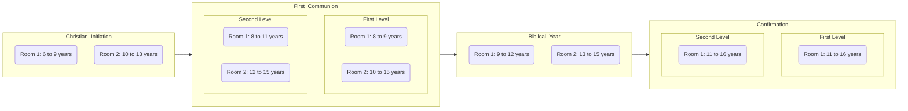
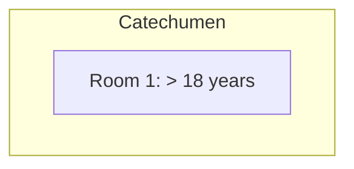
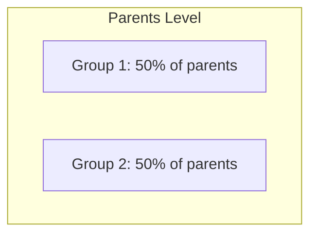

## 1. Project Overview

This application supports catechism programs in a Catholic parish by guiding catechizands through Christian Initiation, First Communion, and Confirmation, and by enabling catechists to record:

- **Attendance** (present, absent, justified absence per session)
- **Assessments** (1–10 scale, ad hoc)
- **Homework** (1–10 scale, ad hoc)

Role-based views ensure Administrators, Catechists, and Parents/Representatives access the right data.

### 1.1 Sacramental Objectives & Levels

The liturgical year is divided into levels with age-based rooms:

#### 1.1.1 Regular Program

#### 1.1.2 Catechumen Program

#### 1.1.3 Parents Program

- Completing **First Communion – Second Level** qualifies child catechizands for First Communion.
- Completing **Confirmation – Second Level** qualifies child catechizands for Confirmation as children.
- Adults in **Catechumen** level (> 18 years) undergo a one‑year Confirmation preparation.

At year start, Administrators create rooms and assign catechizands and catechists.