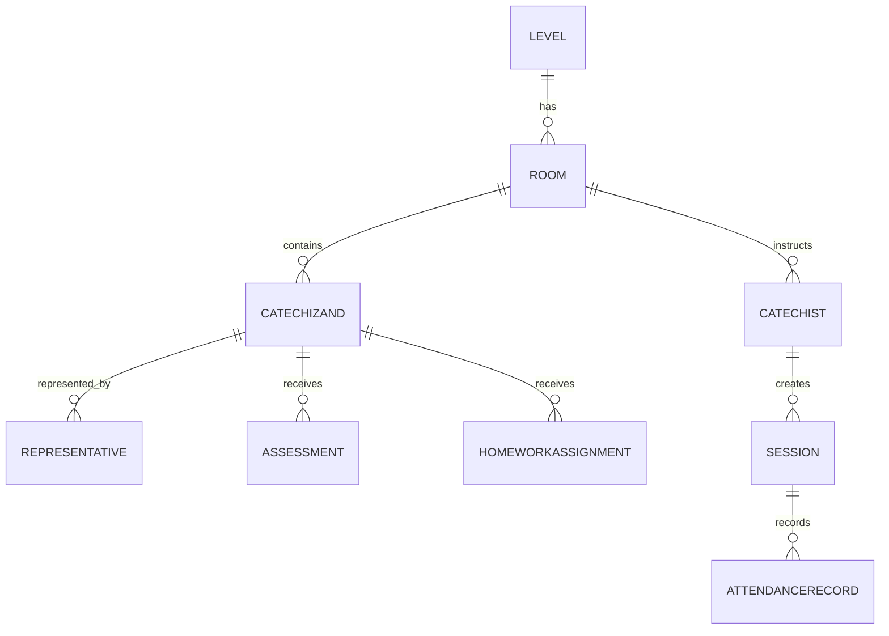

## 2. Data Model & Entities

### 2.1 Terminology

- **Catechizand**: any enrolled person (child or adult).
- **Catechumen**: adult catechizand in the separate **Catechumen** level.
- **Representative**: parent/guardian of a child catechizand; also enrolled in "Parents" level.

### 2.2 Tables & Attributes

```text
levels (
  id PK,
  name VARCHAR,
  description TEXT
)

rooms (
  id PK,
  level_id FK → levels.id,
  name VARCHAR,
  year INT
)

catechizands (
  id PK,
  national_id VARCHAR UNIQUE,
  name VARCHAR,
  birthdate DATE,
  contact_phone VARCHAR,
  photo_url VARCHAR,
  comments TEXT
)

representatives (
  id PK,
  catechizand_id FK → catechizands.id,
  relationship_type VARCHAR
)

catechists (
  id PK,
  national_id VARCHAR UNIQUE,
  name VARCHAR,
  contact_phone VARCHAR
)

sessions (
  id PK,
  room_id FK → rooms.id,
  catechist_id FK → catechists.id,
  date DATE,
  topic VARCHAR
)

attendance_records (
  id PK,
  session_id FK → sessions.id,
  catechizand_id FK → catechizands.id,
  status ENUM('present','absent','justified'),
  note TEXT,
  attachment_url VARCHAR
)

assessments (
  id PK,
  catechizand_id FK → catechizands.id,
  grade INT CHECK(grade BETWEEN 1 AND 10),
  date DATE,
  catechist_id FK → catechists.id,
  comments TEXT
)

homework_assignments (
  id PK,
  catechizand_id FK → catechizands.id,
  grade INT CHECK(grade BETWEEN 1 AND 10),
  date DATE,
  catechist_id FK → catechists.id,
  comments TEXT
)
```

### 2.3 Relationships (ER Diagram)



- At year start, Admins create levels, rooms, assign catechizands and catechists.