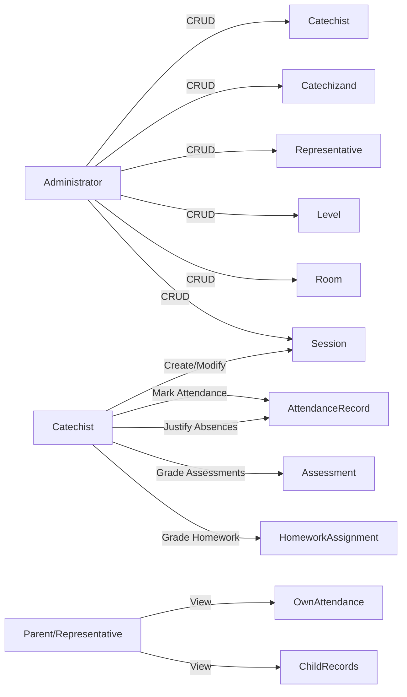

## 3. User Roles & Permissions

### 3.1 Administrator

- Full CRUD on catechists, catechizands, representatives, levels, rooms, sessions.
- Assign catechists ↔ rooms; catechizands ↔ rooms.

### 3.2 Catechist

- **Session Management**: create sessions (date, topic, room).
- **Attendance**: present/absent/justified; modify absent → justified with note/attachment.
- **Grading**: add assessments and homework grades (1–10).

### 3.3 Parent/Representative

- **Read-only**: view own attendance in "Parents" level and child catechizand records.