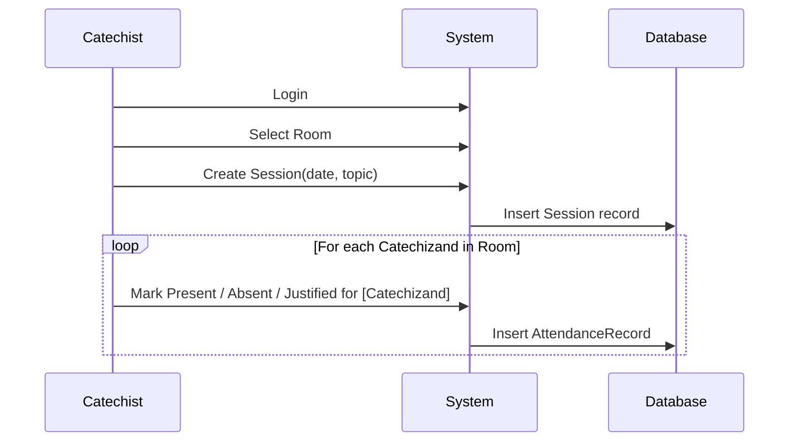
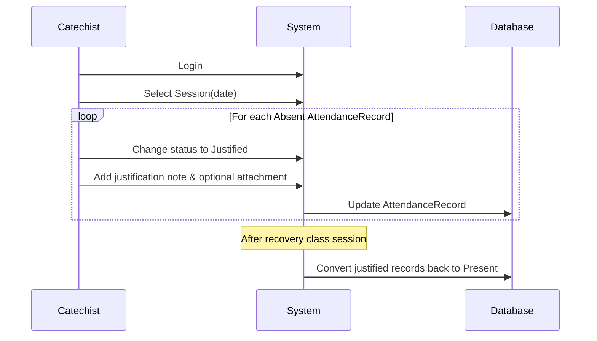
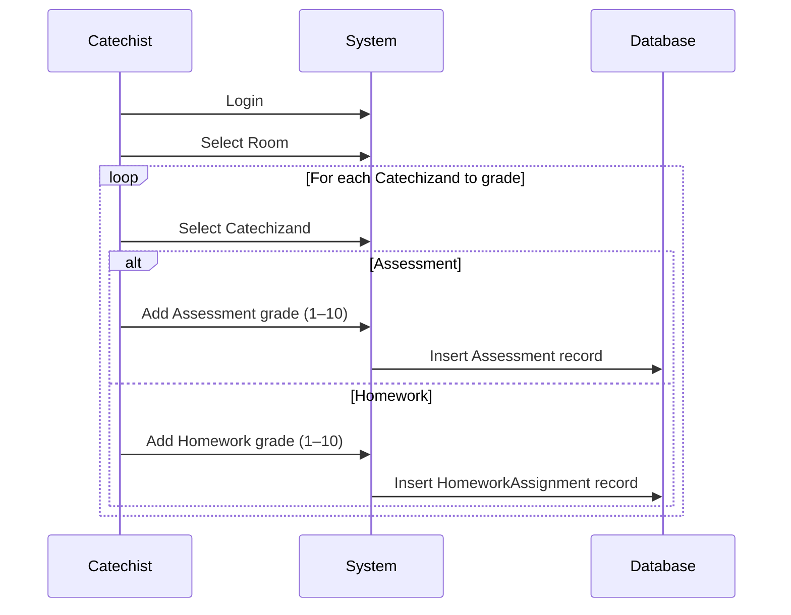

## 4. Session & Evaluation Workflows

### 4.1 Attendance Recording

### 4.2 Justifying Absences

### 4.3 Assessments & Homework

- Attendance records and justified absences are immutable except that justified absences convert to attendance after a recovery class.
- Assessment and homework grades are timestamped and tied to the creating Catechist.
