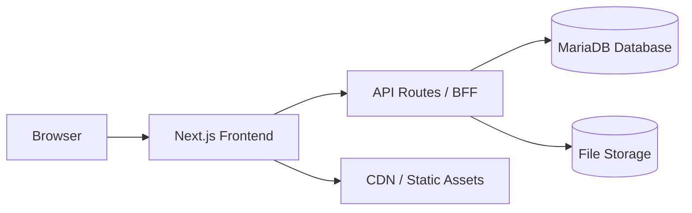

## 5. UI/UX & Technical Stack Specifications

### 5.1 Architecture Overview

### 5.2 Frontend

- **Framework**: React with Next.js (latest) for SSR and API routes.
- **Styling**: Tailwind CSS; mobile-first, responsive design.
- **Views**:
  - **Admin**: CRUD dashboards and forms.
  - **Catechist**: session form, attendance grid, grading UI.
  - **Parent**: summary dashboard, attendance %, average grades, absence count, detailed catechizand view.

### 5.3 Backend

- **Primary**: Next.js API routes.
- **Alternative**: Express.js microservices.
- **ORM**: TypeORM or Prisma.
- **Database**: MariaDB.

### 5.4 Authentication & File Storage

- **Auth**: national ID login with role-based access control.
- **Attachments**: stored in cloud bucket or server directory; secure URLs.

### 5.5 Development Approach

- **Mobile-first**: design for phones/tablets.
- **Tech**: TypeScript throughout.
- **Deployment**: Vercel for frontend; managed MariaDB for database; S3/Blob for storage.